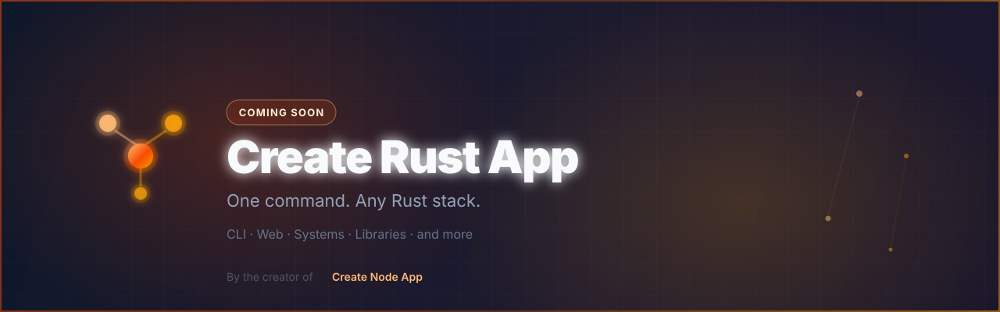

<div align="center">



# Create Rust App

**One command. Any Rust stack.**

> The scaffolding toolkit for the [Rust programming language](https://www.rust-lang.org), built alongside [Create Node App](https://github.com/Create-Node-App).

[](https://github.com/Create-Rust-App/create-rust-app/blob/main/LICENSE)
[](https://www.rust-lang.org)
[](https://discord.gg/bR5VyATgka)

[Organization](https://github.com/Create-Rust-App) · [Create Node App](https://github.com/Create-Node-App/create-node-app) · [Website](#status)

</div>

---

## What is this?

`Create Rust App` brings the composition-first scaffolding philosophy of [create-awesome-node-app](https://github.com/Create-Node-App/create-node-app) to the Rust ecosystem.

Pick a template. Layer extensions. Bootstrap production-ready Rust projects without the usual setup overhead.

```bash
create-rust-app my-project --template web-server
```

> The CLI and template bank are coming soon. Watch this space.

---

## Community

Questions, ideas, template requests, and collaboration are welcome in the Create Awesome community.

[](https://discord.gg/bR5VyATgka)

---

## About the author

This project is maintained by [Ulises Jeremias](https://github.com/ulises-jeremias), author of [Create Node App](https://github.com/Create-Node-App) and several foundational libraries in the V ecosystem:

| Project | Description |
|---------|-------------|
| [vlang/vsl](https://github.com/vlang/vsl) | V Scientific Library: linear algebra, stats, optimization |
| [vlang/vtl](https://github.com/vlang/vtl) | V Tensor Library: n-dimensional tensors for V |
| [ulises-jeremias/rxv](https://github.com/ulises-jeremias/rxv) | Reactive Extensions for V |
| [vlang/setup-v](https://github.com/vlang/setup-v) | GitHub Action to set up V in CI workflows |

---

## Available Templates

| Template | Stack | Status |
|----------|-------|--------|
| Web Server | web | Planned |
| CLI App | cli | Planned |
| Library Starter | modules, docs, tests | Planned |
| Systems App | low-level / `#![no_std]` options | Planned |

Catalog (coming soon): `cra-templates`

---

## Available Extensions

- **Tooling**: `cargo fmt`, `cargo clippy`, GitHub Actions with a pinned Rust toolchain
- **Database**: SQLite, PostgreSQL samples
- **Deployment**: Docker, static binaries
- **Dev environment**: Dev containers

---

## Status

**Coming soon**: the CLI (`create-rust-app`) and the official template bank (`cra-templates`) are under construction. This repository hosts the organization profile and shared community files.

The Rust counterpart of:

→ **[create-awesome-node-app.vercel.app](https://create-awesome-node-app.vercel.app)**

---

## 👥 Contributors

Contributor graphs will appear here once `create-rust-app` and `cra-templates` land.

Made with [contrib.rocks](https://contrib.rocks).

---

## Part of the Create Awesome App ecosystem

| Org | Stack | Status |
|-----|-------|--------|
| [Create-Node-App](https://github.com/Create-Node-App) | Node.js, TypeScript | ✅ Production |
| [Create-Python-App](https://github.com/Create-Python-App) | Python | ✅ Production |
| [Create-Vlang-App](https://github.com/Create-Vlang-App) | V language | ✅ Shipped (`0.1.0`) |
| [Create-Rust-App](https://github.com/Create-Rust-App) | Rust | 🚧 In progress |
